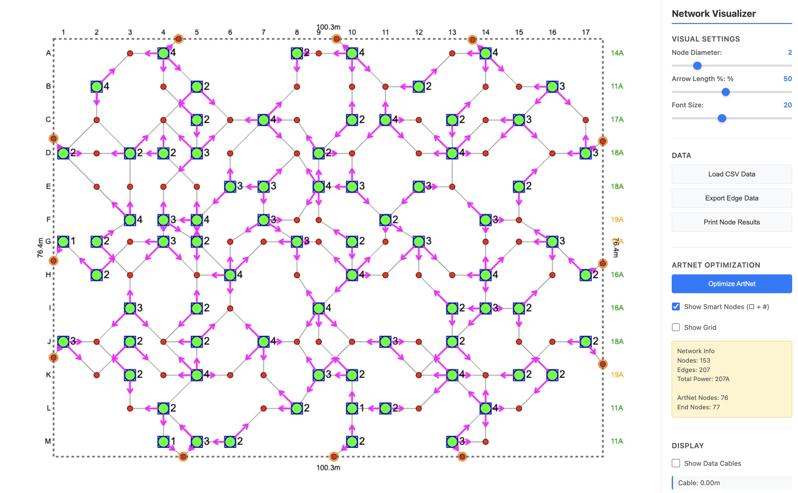
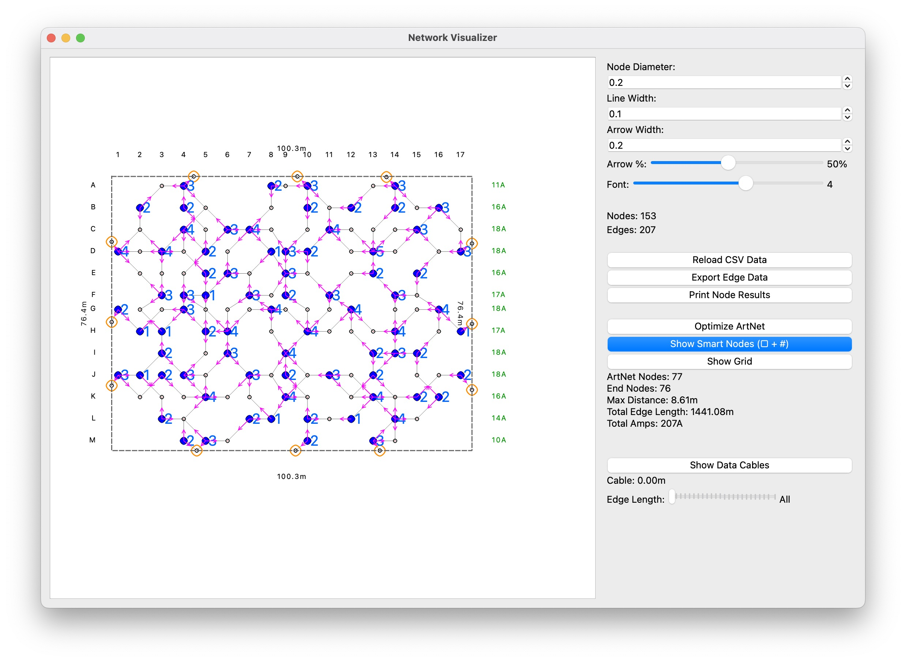

# Network Visualizer

**Note: This project was developed with AI assistance.**

A comprehensive LED network visualization and optimization tool. This project includes both a web-based application and a Python desktop application for visualizing and optimizing LED network configurations, ArtNet node placement, and power distribution.

## 🌐 Live Demo

**[View Live Demo on GitHub Pages](https://stephanschulz.ca/light-network/)**

*(Update the URL above with your GitHub username after deployment)*

## Overview

This toolkit helps visualize and optimize LED network configurations for large-scale art installations. It provides:

- **Interactive network visualization** with customizable rendering
- **ArtNet node optimization** to minimize network complexity
- **Power distribution optimization** across multiple circuits
- **Real-time cable length calculations** for both data and power
- **Edge filtering and grouping** by length

### Screenshots

#### Web Application


#### Python Desktop Application


## Project Structure

```
node-edge-network/
├── network-visualizer-web/        # Web application (JavaScript)
│   ├── app.js                     # Main application logic
│   ├── index.html                 # Web interface
│   └── styles.css                 # Styling
├── python-app/                    # Python desktop application
│   ├── network_visualizer.py      # Main PySide6 GUI
│   ├── artnet_optimizer.py        # ArtNet optimization algorithms
│   ├── power_optimizer.py         # Power distribution optimization
│   └── requirements.txt           # Python dependencies
├── data/                          # Network data files
│   ├── Oct10_003_stephan.csv      # Sample network data
│   ├── March27_002_stephan.csv    # Additional sample data
│   └── edge_data_export.csv       # Sample export data
├── docs/                          # Documentation
│   ├── ALGORITHM_COMPARISON.md    # Algorithm comparisons
│   └── OPTIMIZATION_GUIDE.md      # Optimization guide
└── README.md                      # This file
```

## Features Comparison

| Feature | Web App | Python App |
|---------|---------|------------|
| Interactive Visualization | ✅ | ✅ |
| ArtNet Optimization | ✅ | ✅ |
| Power Optimization | ✅ | ✅ |
| No Installation Required | ✅ | ❌ |
| Offline Use | ❌ | ✅ |
| Export Data | ✅ | ✅ |
| Cross-Platform | ✅ | ✅ |
| 3D Visualization | Planned | ✅ |

## 🌐 Web Application

### Quick Start

1. **Online (Recommended):** Visit the [live demo](https://YOUR-USERNAME.github.io/node-edge-network/network-visualizer-web/)

2. **Local Development:**
   ```bash
   cd network-visualizer-web
   python -m http.server 8000
   # Open http://localhost:8000 in your browser
   ```

### Features

#### Network Visualization
- **Canvas-based rendering** using HTML5 Canvas API
- **Adjustable visual settings:**
  - Node diameter (0.1-10)
  - Arrow length percentage (10-100%)
  - Font size for labels (6-40)
- **Interactive tooltips** showing node and edge information
- **Zoom and pan** for detailed inspection

#### ArtNet Optimization
The web app includes sophisticated algorithms to optimize ArtNet node placement:

- **K-means clustering** for spatial distribution
- **Degree centrality analysis** to identify network hubs
- **Cable length minimization** between ArtNet nodes and endpoints
- **Visual display** of optimized node positions with connection counts
- **Smart node placement** using grid-based positioning

**Algorithm:** Uses betweenness centrality and k-means clustering to find optimal ArtNet node locations that minimize total cable length while balancing the number of connections per node.

#### Power Distribution Optimization
- **Multi-circuit power planning** across 4 configurable power hubs
- **Automatic circuit balancing** to distribute load evenly
- **Power calculation:** Each LED edge requires 120W
- **Circuit limits:** Configurable (default 1800W per circuit)
- **Cable length optimization** for power distribution
- **Visual representation** of power circuits with color coding

**Algorithm:** Solves a multi-depot vehicle routing problem (mVRP) using:
- OR-Tools constraint solver (when available)
- Greedy nearest-neighbor fallback algorithm
- Simulated annealing for global optimization

#### Data Management
- **CSV Import:** Load network data from CSV files
- **CSV Export:** Export edge data with calculated metrics
- **Text Export:** Print node optimization results
- **Edge filtering:** Filter edges by length groups
- **Toggle displays:** Show/hide data cables, power cables, nodes, grid

### CSV Format

The application expects CSV files with the following columns:

```csv
Edge_ID,start_X,start_Y,start_Z,end_X,end_Y,end_Z,[Type]
1,0.0,0.0,0.0,1.5,2.0,0.0,
2,1.5,2.0,0.0,3.0,4.0,0.0,Intercom
...
```

- **Columns 1-4:** Edge ID, Start point (X, Y, Z)
- **Columns 5-7:** End point (X, Y, Z)
- **Column 8 (optional):** Edge type (e.g., "Intercom")

### Usage Guide

1. **Load Data:** Click "Load CSV Data" to import your network configuration
2. **Optimize ArtNet:** Click "Optimize ArtNet" to calculate optimal node placement
3. **View Results:** Check the info box for statistics (cable saved, nodes used)
4. **Toggle Displays:** Use checkboxes to show/hide different elements
5. **Adjust Visuals:** Use sliders to customize the appearance
6. **Filter Edges:** Use the length filter to isolate specific edge groups
7. **Export Data:** Export results for documentation or further analysis

### Technical Details

**Technology Stack:**
- Pure JavaScript (ES6+)
- HTML5 Canvas API
- No external dependencies
- Responsive design

**Performance:**
- Handles networks with 1000+ nodes
- Real-time rendering updates
- Efficient canvas drawing with transforms
- Optimized coordinate system scaling

## 🐍 Python Desktop Application

### Installation

1. **Navigate to the Python app directory:**
   ```bash
   cd python-app
   ```

2. **Create a virtual environment (if not exists):**
   ```bash
   python -m venv venv
   ```

3. **Activate the virtual environment:**
   - macOS/Linux:
     ```bash
     source venv/bin/activate
     ```
   - Windows:
     ```bash
     venv\Scripts\activate
     ```

4. **Install dependencies:**
   ```bash
   pip install -r requirements.txt
   ```

### Running the Application

```bash
python network_visualizer.py
```

### Features

#### Main Application (`network_visualizer.py`)
- **PySide6-based GUI** with interactive graphics view
- **Real-time visualization updates** as parameters change
- **Mouse tracking** with tooltips for node information
- **Customizable rendering:**
  - Node diameter, line width, arrow dimensions
  - Font sizes for labels
  - Toggle displays (ArtNet nodes, data/power cables, grid)
- **Circuit filtering** to view specific power circuits
- **Export functionality** for optimization results

#### ArtNet Optimizer (`artnet_optimizer.py`)
Core algorithms for optimizing ArtNet node placement:

**Key Classes:**
- `ArtNetOptimizer`: Main optimizer class

**Optimization Methods:**
1. **Degree Centrality Analysis**
   - Identifies highly connected nodes
   - Prioritizes network hubs

2. **K-Means Clustering**
   - Spatially distributes ArtNet nodes
   - Ensures even coverage across network

3. **BFS Assignment**
   - Assigns regular nodes to nearest ArtNet nodes
   - Minimizes cable runs

4. **Cable Length Calculation**
   - Computes total cable required
   - Provides before/after optimization metrics

**Example Output:**
```
ArtNet Optimization Results:
- Optimal Smart Nodes: 12
- Total Data Cable Length: 245.8m
- Cable Saved vs. No Smart Nodes: 1,234.5m (83.4%)
- Average Cable per Smart Node: 20.5m
```

#### Power Optimizer (`power_optimizer.py`)
Sophisticated power distribution optimization using constraint solving:

**Key Functions:**
- `calculate_node_power_requirements()`: Calculates power needs per node
- `get_window_edge_centers()`: Positions power hubs optimally
- `optimize_hub_positions()`: Exhaustively tests hub configurations
- `optimize_power_distribution()`: Routes power cables efficiently

**Optimization Strategies:**
1. **OR-Tools Constraint Solver** (when available)
   - Multi-depot VRP formulation
   - Capacity constraints (1800W per circuit)
   - Distance minimization objective

2. **Greedy Algorithm** (fallback)
   - Nearest-neighbor heuristic
   - Power capacity tracking
   - 2-opt improvement

3. **Simulated Annealing**
   - Global optimization
   - Temperature-based acceptance
   - Neighbor swapping

**Circuit Balancing:**
- Distributes nodes across 4 circuits
- Respects 1800W limit (15A @ 120V)
- Minimizes total cable length
- Provides per-circuit statistics

**Example Output:**
```
Power Optimization Results:
Circuit 1: 6 nodes, 1680W, 234.5m cable
Circuit 2: 5 nodes, 1320W, 198.3m cable
Circuit 3: 4 nodes, 960W, 156.2m cable
Circuit 4: 7 nodes, 1800W, 267.8m cable
Total: 22 nodes, 856.8m power cable
```

### Dependencies

```txt
PySide6>=6.6.0        # Qt for Python - GUI framework
pandas>=2.0.0         # Data manipulation
numpy>=1.24.0         # Numerical computing
ortools>=9.7.0        # Google OR-Tools (optional, for advanced optimization)
```

## Algorithms Deep Dive

### ArtNet Optimization Algorithm

**Problem:** Given N LED nodes connected in a network, find the optimal number and placement of "smart" ArtNet nodes to minimize data cable length.

**Approach:**
1. **Build Network Graph:** Create adjacency list from edge data
2. **Calculate Centrality:** Rank nodes by number of connections
3. **Iterate Smart Node Counts:** Test 1 to N smart nodes
4. **For each count:**
   - Use k-means to distribute smart nodes spatially
   - Assign each regular node to nearest smart node (BFS)
   - Calculate total cable length
5. **Select Optimal:** Choose count with minimum total cable

**Complexity:** O(N² × M) where N = nodes, M = iterations

**Optimization:** Uses early stopping when cable savings plateau

### Power Distribution Algorithm

**Problem:** Route power from 4 hubs to M ArtNet nodes, respecting circuit capacity (1800W), minimizing cable length.

**Approach (OR-Tools):**
1. **Model as mVRP:** Multi-depot vehicle routing problem
2. **Constraints:**
   - Each node visited exactly once
   - Circuit capacity ≤ 1800W
   - Routes start/end at hubs
3. **Objective:** Minimize Σ(cable lengths)
4. **Solve:** Constraint propagation + local search

**Approach (Greedy Fallback):**
1. **Initialize:** 4 empty circuits
2. **For each ArtNet node (sorted by power needs):**
   - Find nearest hub with remaining capacity
   - Assign node to that circuit
3. **Improve:** 2-opt swaps between circuits

**Complexity:** O(M² × H) where M = ArtNet nodes, H = hubs

## Workflow Example

### Typical Use Case

1. **Import Network Data**
   - Load CSV with LED positions and connections
   - Application displays initial network

2. **Optimize ArtNet Placement**
   - Click "Optimize ArtNet"
   - Review suggestions for number of smart nodes
   - Observe cable savings (typically 70-85%)

3. **Optimize Power Distribution**
   - Run power optimization
   - Review circuit assignments
   - Check power balance across circuits

4. **Fine-tune Display**
   - Adjust visual parameters for clarity
   - Filter by edge length groups
   - Toggle cable displays

5. **Export Results**
   - Export edge data with assignments
   - Print node results for documentation
   - Save network diagram

## Development

### Web Application
- Pure JavaScript - no build process required
- Edit files directly in `network-visualizer-web/`
- Refresh browser to see changes

### Python Application
- Uses PySide6 for Qt-based GUI
- Modular design: separate files for optimization logic
- Virtual environment isolates dependencies

## Troubleshooting

### Web Application
- **Blank canvas:** Check browser console for errors
- **CSV not loading:** Verify CSV format matches specification
- **Performance issues:** Try reducing number of visible edges with filters

### Python Application
- **Import errors:** Ensure virtual environment is activated and dependencies installed
- **Slow optimization:** OR-Tools provides significant speedup if installed
- **Display issues:** Check Qt/PySide6 installation

## Future Enhancements

- [ ] 3D visualization in web application
- [ ] Real-time collaboration features
- [ ] Database backend for large networks
- [ ] WebGL rendering for performance
- [ ] Advanced routing algorithms (A*, Dijkstra)
- [ ] Network simulation and testing
- [ ] Cost estimation tools
- [ ] Export to CAD formats

## Credits

Developed for Cistern Houston artwork installation.

**Note: This project was developed with AI assistance.**

## License

[Add your license here]

## Contact

[Add your contact information here]
